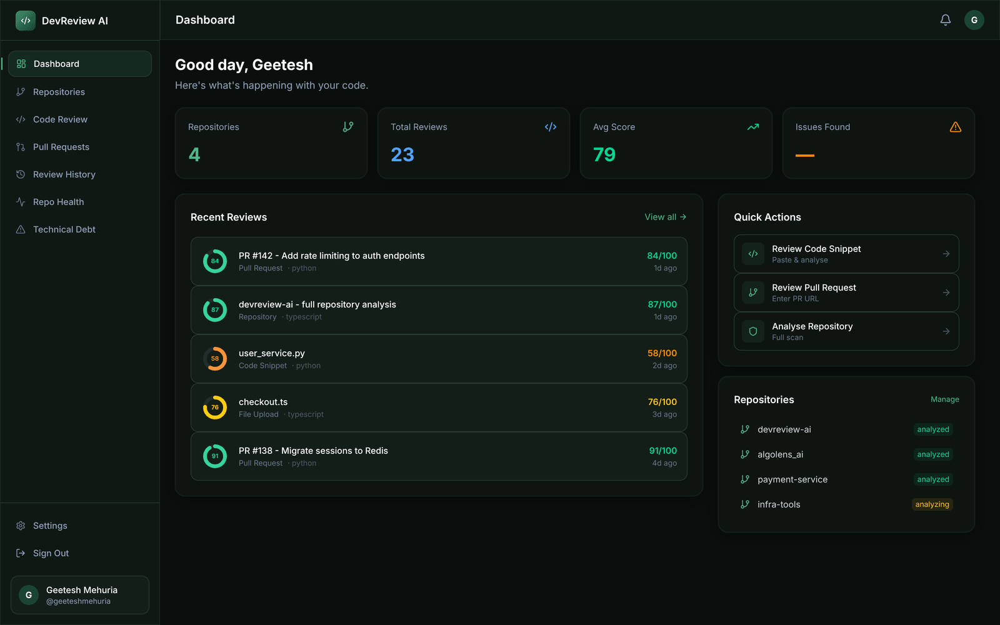
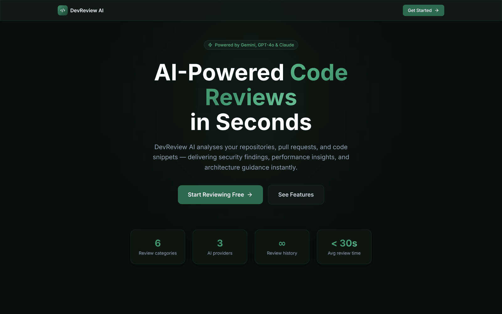
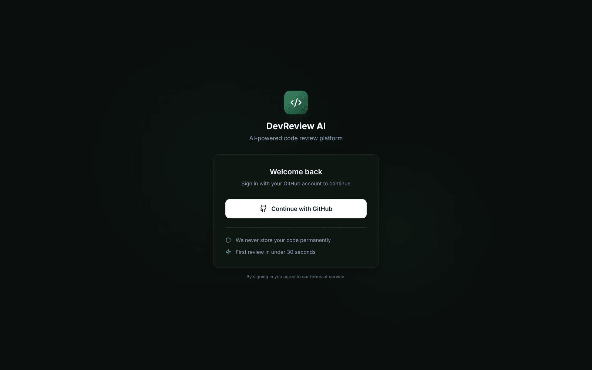
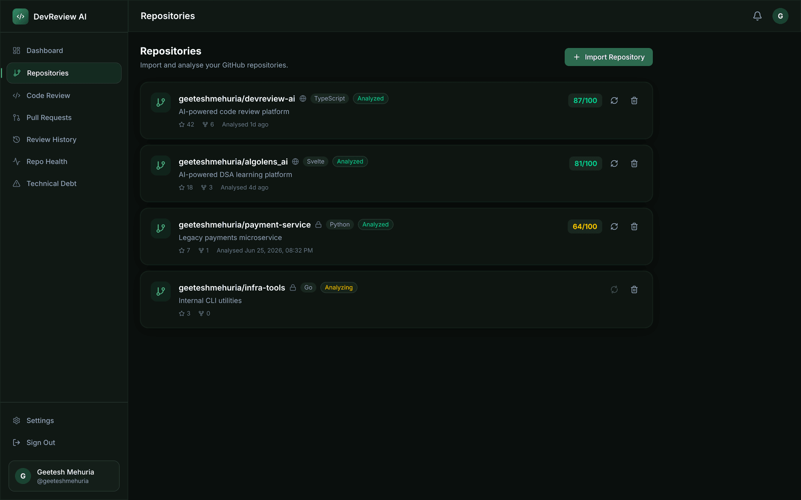
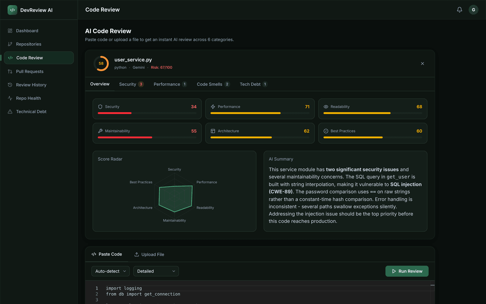
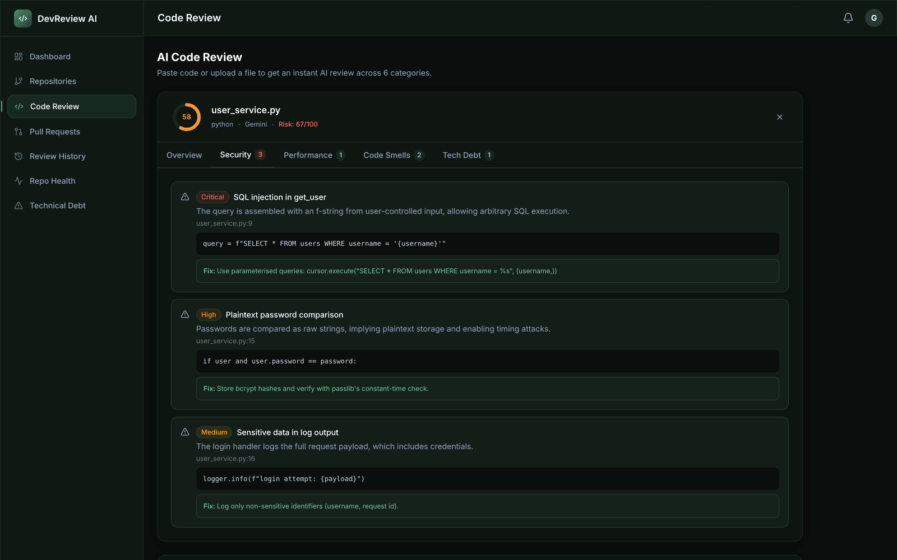
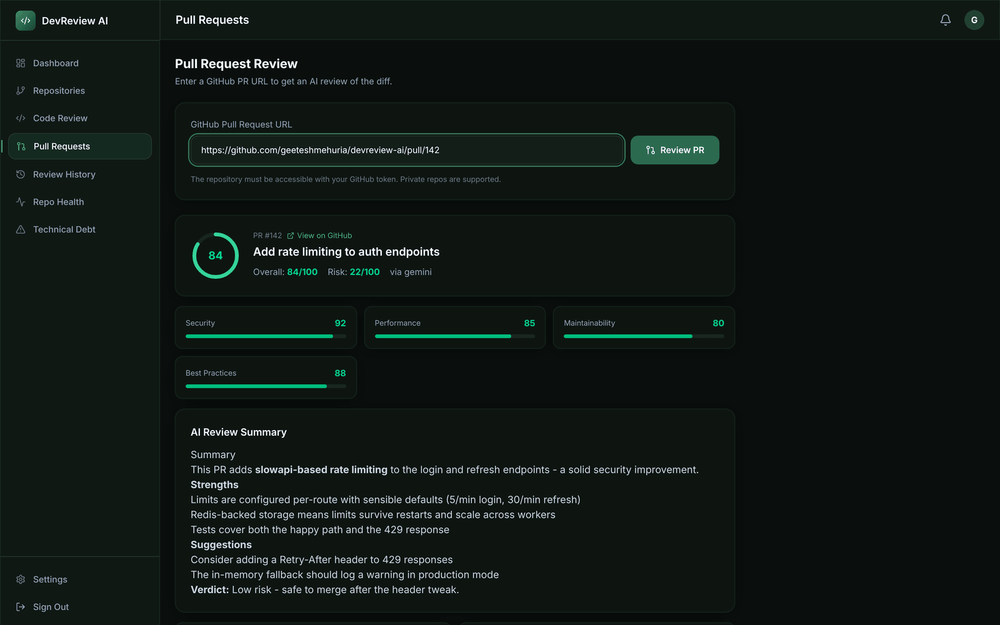
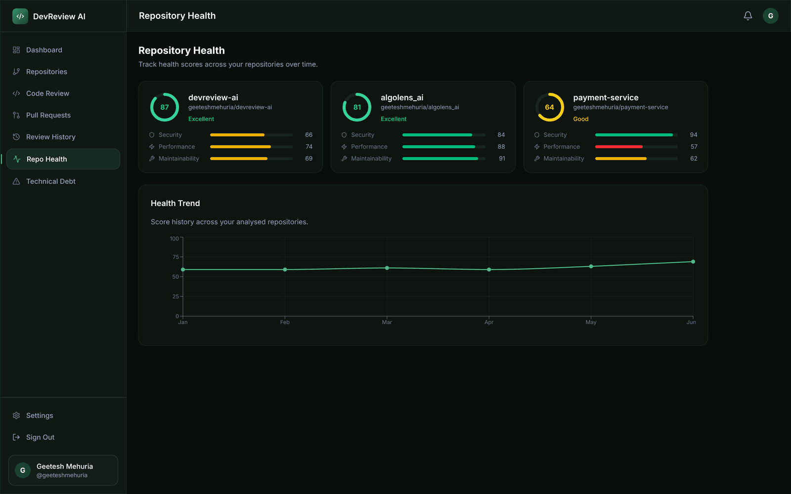
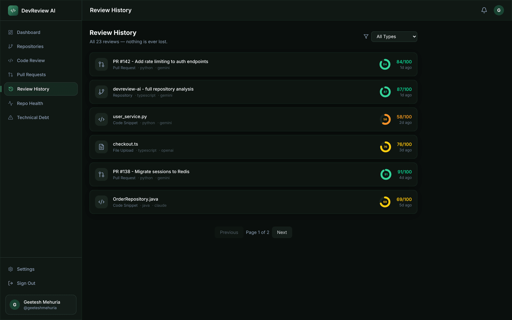

<div align="center">

# DevReview AI

**AI-powered code reviews in seconds.**

Analyse repositories, review pull requests, detect security vulnerabilities, and track technical debt — powered by Google Gemini with OpenAI and Claude fallbacks.

[**Live Demo**](https://devreview-ai-mu.vercel.app) · [Features](#features) · [Screenshots](#screenshots) · [Architecture](#architecture) · [Setup](#setup) · [Deployment](#deployment)

[](https://nextjs.org)
[](https://react.dev)
[](https://typescriptlang.org)
[](https://tailwindcss.com)
[](https://fastapi.tiangolo.com)
[](https://python.org)
[](https://postgresql.org)
[](https://redis.io)
[](https://docs.docker.com/compose/)
[](#license)

<br/>



</div>

---

## Overview

**DevReview AI** turns code review into a 30-second operation. Sign in with GitHub, then paste a snippet, upload a file, import a repository, or drop in a pull-request URL — and get a structured AI review: per-category scores, severity-ranked security findings with CWE tags, performance issues, code smells, and technical-debt estimates, each with a concrete fix.

**The problem it solves:** manual review is slow, inconsistent, and easy to skip under deadline pressure. DevReview AI gives every developer an instant, repeatable second pair of eyes — before code reaches a human reviewer.

Under the hood it is a production-grade full-stack application demonstrating:

- **Frontend Engineering** — Next.js 15 App Router, React 19, TypeScript, Tailwind CSS v4
- **Backend Engineering** — FastAPI with clean architecture (routers → services → repositories)
- **AI Integration** — Provider abstraction layer (Gemini primary, OpenAI + Claude fallbacks)
- **Database Design** — PostgreSQL with 12-table relational schema, UUID PKs, JSONB columns
- **System Design** — Redis caching, background jobs, token refresh rotation
- **Security** — GitHub OAuth, JWT with refresh rotation, middleware protection, rate limiting
- **Performance** — Query caching, lazy loading, dynamic imports, connection pooling
- **Testing** — Vitest + RTL (frontend), Pytest (backend), Playwright E2E
- **DevOps** — Docker Compose, multi-stage Dockerfiles, health checks

---

## Features

| Feature | Description |
|---|---|
| **AI Code Review** | Paste or upload code — get security, performance, readability, maintainability, architecture, and best-practices scores |
| **Pull Request Review** | Enter a GitHub PR URL — AI analyses the diff and produces risk score + findings |
| **Repository Analysis** | Import a GitHub repo — clone, scan, and generate full architecture + health report |
| **Repository Health** | 0–100 score with radar chart and historical trend graph |
| **Technical Debt** | Severity-ranked debt items with estimated remediation hours |
| **Review History** | Every review stored — paginated timeline, previous findings, never lost |
| **GitHub OAuth** | Secure sign-in with JWT access/refresh tokens and server-side route protection |

---

## Architecture

```
┌─────────────────────────────────────────────────────────────────┐
│                         BROWSER                                 │
│  Next.js 15 (App Router)                                        │
│  ┌──────────┐ ┌──────────┐ ┌──────────┐ ┌───────────────────┐  │
│  │  Auth    │ │  Review  │ │  Repos   │ │  History / Health │  │
│  │  Pages   │ │  Editor  │ │  Manager │ │  Dashboards       │  │
│  └──────────┘ └──────────┘ └──────────┘ └───────────────────┘  │
│  Zustand (auth state) │ TanStack Query (server state)           │
│  Framer Motion │ Recharts │ Monaco Editor                       │
└────────────────────────┬────────────────────────────────────────┘
                         │ HTTPS / JSON
┌────────────────────────▼────────────────────────────────────────┐
│                       FASTAPI                                   │
│  ┌─────────┐ ┌──────────┐ ┌────────────┐ ┌──────────────────┐  │
│  │  Auth   │ │ Reviews  │ │   Repos    │ │   Pull Requests  │  │
│  │ Router  │ │  Router  │ │   Router   │ │      Router      │  │
│  └─────────┘ └──────────┘ └────────────┘ └──────────────────┘  │
│  ┌─────────────────────────────────────────────────────────┐   │
│  │              Service Layer                              │   │
│  │  AuthService │ ReviewService │ RepositoryService        │   │
│  └──────────────────────┬──────────────────────────────────┘   │
│                         │                                       │
│  ┌──────────────────────▼──────────────────────────────────┐   │
│  │              AI Provider Layer                          │   │
│  │  AIProvider (abstract)                                  │   │
│  │  ├── GeminiProvider (primary)                           │   │
│  │  ├── OpenAIProvider (fallback)                          │   │
│  │  └── ClaudeProvider (fallback)                          │   │
│  │  PromptBuilder → Provider → ResponseFormatter           │   │
│  └─────────────────────────────────────────────────────────┘   │
└──────────┬──────────────────────────────┬───────────────────────┘
           │                              │
    ┌──────▼──────┐               ┌───────▼──────┐
    │ PostgreSQL  │               │    Redis     │
    │  (primary)  │               │   (cache +   │
    │             │               │   sessions)  │
    └─────────────┘               └──────────────┘
```

---

## Database Schema

```sql
users                   -- GitHub OAuth users, JWT refresh tokens
user_settings           -- Per-user preferences (provider, notifications)
repositories            -- Imported GitHub repos with metadata + status
repository_health       -- Timestamped health snapshots (enables trends)
pull_requests           -- GitHub PR metadata + risk scores
reviews                 -- Root record for each AI analysis run
review_results          -- Per-category scores (security: 72, perf: 88...)
security_findings       -- OWASP/CWE vulnerabilities with severity
performance_findings    -- Performance issues with impact estimates
code_smells             -- Refactoring opportunities
technical_debt          -- Debt items with estimated remediation hours
audit_logs              -- Append-only audit trail
```

**Design decisions:**
- UUID primary keys (prevent enumeration attacks)
- JSONB columns for flexible AI response evolution without migrations
- `repository_health` stores snapshots, not updates — enables trend graphs
- `reviews` as aggregate root — efficient pagination without joining all child tables
- Indexes on `user_id`, `review_type`, `severity`, `created_at` for common query patterns

---

## AI Provider Architecture

```python
AIProvider (abstract)
  ├── GeminiProvider    → gemini-2.0-flash-exp  (primary, best free tier)
  ├── OpenAIProvider    → gpt-4o-mini           (fallback)
  └── ClaudeProvider    → claude-3-5-haiku      (fallback)

get_ai_provider(preferred) → cascades through chain until one succeeds
```

**Key design choices:**
- Business logic never imports concrete providers — only `AIProvider`
- `PromptBuilder` is separate from providers — prompts can be A/B tested independently
- `ResponseFormatter` normalises JSON output — handles markdown fences, partial JSON, etc.
- `tenacity` retry with exponential backoff on all provider calls
- Provider instances are cached after first successful init

---

## Tech Stack

### Frontend
| Layer | Technology |
|---|---|
| Framework | Next.js 15 (App Router) + React 19 |
| Language | TypeScript 5.7 |
| Styling | Tailwind CSS v4 |
| UI Components | Radix UI primitives |
| State | Zustand (auth) + TanStack Query (server) |
| Forms | React Hook Form + Zod |
| Charts | Recharts |
| Animations | Framer Motion |
| Editor | Monaco Editor |
| Notifications | Sonner |
| Markdown | react-markdown + remark-gfm |

### Backend
| Layer | Technology |
|---|---|
| Framework | FastAPI 0.115 |
| Language | Python 3.12 |
| Database | PostgreSQL 16 (asyncpg driver) |
| ORM | SQLAlchemy 2.0 (async) |
| Migrations | Alembic |
| Cache | Redis 7 |
| Auth | GitHub OAuth + JWT (python-jose) |
| AI | google-generativeai / openai / anthropic |
| Logging | structlog |
| Rate Limiting | slowapi |

### Infrastructure
| Component | Technology |
|---|---|
| Containerisation | Docker + Docker Compose |
| Background Jobs | Celery + Redis |
| CI | GitHub Actions (configured) |

---

## Project Structure

```
devreview-ai/
├── frontend/                   # Next.js 15 application
│   ├── app/
│   │   ├── (auth)/             # Login + OAuth callback
│   │   ├── (dashboard)/        # Protected dashboard routes
│   │   │   ├── dashboard/      # Overview
│   │   │   ├── review/         # Code review (paste / upload)
│   │   │   ├── repositories/   # Repository management
│   │   │   ├── pull-requests/  # PR review
│   │   │   ├── history/        # Review history + detail
│   │   │   ├── health/         # Repository health dashboard
│   │   │   ├── debt/           # Technical debt tracker
│   │   │   └── settings/       # User settings
│   │   └── layout.tsx
│   ├── components/
│   │   ├── layout/             # Sidebar, Header
│   │   ├── providers/          # Theme, Query, Auth providers
│   │   ├── review/             # ReviewResultPanel with tabs
│   │   └── shared/             # ScoreRing, Skeleton, etc.
│   ├── lib/
│   │   ├── api/                # Typed API client (axios)
│   │   ├── stores/             # Zustand stores
│   │   └── utils/              # Formatters, colour helpers
│   ├── types/                  # TypeScript interfaces
│   ├── middleware.ts            # Edge auth guard (no dashboard flash)
│   └── tests/                  # Vitest unit + Playwright E2E
│
├── backend/                    # FastAPI application
│   ├── app/
│   │   ├── main.py             # FastAPI app + middleware
│   │   ├── routers/            # auth, reviews, repositories, pull_requests
│   │   ├── services/           # auth_service, review_service, repository_service
│   │   ├── models/             # SQLAlchemy ORM models
│   │   ├── schemas/            # Pydantic request/response schemas
│   │   ├── ai/                 # Provider abstraction layer
│   │   │   ├── base.py         # Abstract AIProvider + dataclasses
│   │   │   ├── factory.py      # get_ai_provider() with fallback chain
│   │   │   ├── prompts.py      # PromptBuilder (provider-agnostic)
│   │   │   ├── response_formatter.py
│   │   │   └── providers/      # GeminiProvider, OpenAIProvider, ClaudeProvider
│   │   ├── core/               # config, database, redis, security, exceptions
│   │   ├── middleware/         # JWT auth dependency
│   │   └── tests/              # Pytest tests
│   ├── alembic/                # DB migrations
│   ├── Dockerfile
│   └── requirements.txt
│
├── docker-compose.yml
└── README.md
```

---

## Setup

### Prerequisites

- Docker + Docker Compose
- GitHub OAuth App ([create one here](https://github.com/settings/applications/new))
- Google Gemini API key ([get one here](https://aistudio.google.com/apikey))

### 1. Clone the repository

```bash
git clone https://github.com/geeteshmehuria/devreview-ai.git
cd devreview-ai
```

### 2. Create a GitHub OAuth App

1. Go to **GitHub → Settings → Developer Settings → OAuth Apps → New OAuth App**
2. Set **Homepage URL**: `http://localhost:3000`
3. Set **Authorization callback URL**: `http://localhost:3000/auth/callback`
4. Copy **Client ID** and **Client Secret**

### 3. Configure environment variables

```bash
# Backend
cp backend/.env.example backend/.env
# Edit backend/.env — set:
# GITHUB_CLIENT_ID, GITHUB_CLIENT_SECRET
# GEMINI_API_KEY
# SECRET_KEY (any 32+ char random string)
# JWT_SECRET_KEY (any 32+ char random string)

# Frontend
cp frontend/.env.example frontend/.env.local
# Edit frontend/.env.local — set:
# NEXT_PUBLIC_GITHUB_CLIENT_ID (same as above)
```

### 4. Start with Docker Compose

```bash
docker compose up --build
```

This starts PostgreSQL, Redis, FastAPI backend, and Next.js frontend.

### 5. Run database migrations

```bash
docker compose exec backend alembic upgrade head
```

### 6. Open the app

- **Frontend**: http://localhost:3000
- **API Docs**: http://localhost:8000/api/docs

---

## Deployment

Production deploys to **Render** (backend + Postgres + Redis) and **Vercel**
(frontend). The repo ships a Render Blueprint (`render.yaml`) and Vercel config
(`frontend/vercel.json`). See **[DEPLOYMENT.md](./DEPLOYMENT.md)** for the full
step-by-step guide, environment variable reference, and troubleshooting.

Production URLs:

- **Frontend**: [https://devreview-ai-mu.vercel.app](https://devreview-ai-mu.vercel.app)
- **Backend API**: `https://devreview-api.onrender.com` (Render free tier — the instance sleeps when idle, so the first request can take ~50s)

---

## Running Tests

### Frontend (Vitest)
```bash
cd frontend
npm install
npm test
```

### Backend (Pytest)
```bash
cd backend
pip install -r requirements.txt
pytest
```

### E2E (Playwright)
```bash
cd frontend
npx playwright install chromium
npm run test:e2e
```

---

## API Documentation

The FastAPI app auto-generates interactive docs at `/api/docs` (Swagger UI) and `/api/redoc`.

### Key endpoints

```
POST   /api/v1/auth/github/callback    Exchange GitHub code for JWT tokens
POST   /api/v1/auth/refresh            Rotate refresh token
GET    /api/v1/auth/me                 Get current user

POST   /api/v1/reviews/code            Review pasted code snippet
POST   /api/v1/reviews/file            Review uploaded file
GET    /api/v1/reviews                 List review history (paginated)
GET    /api/v1/reviews/{id}            Get review detail + findings

POST   /api/v1/repositories            Import a GitHub repository
GET    /api/v1/repositories            List user's repositories
POST   /api/v1/repositories/{id}/analyze  Trigger re-analysis

POST   /api/v1/pull-requests/review    Review a GitHub PR by URL
```

---

## Design Decisions & Tradeoffs

**Why UUID primary keys?**
Sequential integer IDs expose record counts and enable enumeration attacks. UUIDs eliminate both issues with negligible performance cost at portfolio scale.

**Why JSONB for AI responses?**
AI output schema evolves frequently. JSONB lets us iterate on the response format without constant migrations, while still indexing specific keys when needed.

**Why not store the full diff/source code?**
We cap stored content at 50,000 characters. Full content is available from GitHub on demand. This keeps DB storage predictable.

**Why refresh token rotation?**
Stolen refresh tokens are immediately invalidated on next use. The previous refresh token hash is overwritten, forcing re-authentication.

**Why Gemini as the primary provider?**
Gemini has the most generous free tier, making portfolio demos cost-free. The provider abstraction means swapping to GPT-4o or Claude is a one-line config change.

**Why background tasks for repository analysis?**
Cloning and analysing a repository takes 30–120 seconds. FastAPI's `BackgroundTasks` returns the HTTP response immediately while analysis runs, keeping the API responsive.

---

## Screenshots

> UI captures from the current build (populated with sample data).

| Landing | Login |
|---|---|
|  |  |

| Dashboard | Repositories |
|---|---|
|  |  |

| AI Code Review — Overview | Security Findings |
|---|---|
|  |  |

| Pull Request Review | Repository Health |
|---|---|
|  |  |

| Review History |
|---|
|  |

---

## Roadmap

- [ ] Inline PR comments posted back to GitHub via the Checks API
- [ ] Team workspaces with shared review history
- [ ] Custom review rulesets (per-language severity thresholds)
- [ ] Webhook-triggered automatic PR reviews
- [ ] SARIF export for CI integration
- [ ] Aggregated technical-debt dashboard across repositories

---

## Contributing

Contributions are welcome. Fork the repo, create a feature branch, and open a pull request:

```bash
git checkout -b feat/your-feature
# make your changes, add tests
git commit -m "feat: describe your change"
```

Please run the test suites (`npm test`, `pytest`) before submitting, and keep PRs focused on a single change.

---

## Author

**Geetesh Mehuria** — [GitHub](https://github.com/geeteshmehuria) · [Email](mailto:geeteshmaihuria@gmail.com)

---

## License

MIT
